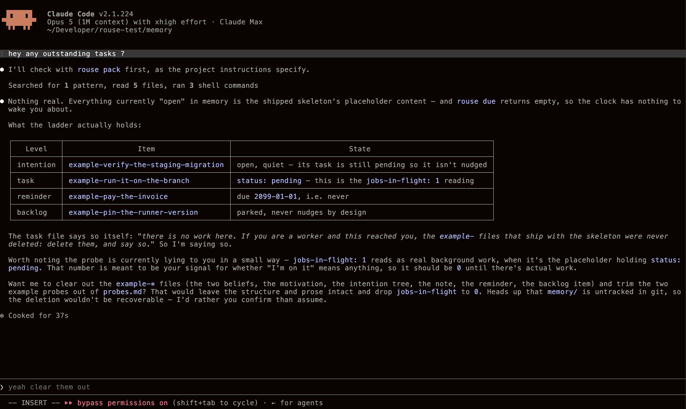

#  rouse

A memory framework for multi-session agent use.

## What is Rouse?

Rouse is a memory framework built with the idea to:

1. make modularization of context easy
2. make multi-session (/sub-agents-driven) autonomous agents' memory work

Rouse provides a memory structure template with tiered logical separators in which certain logically-distinctive pieces of context go. Here is a brief explanation on each:

- persona.md: conversational tuning
- rouse.md: instructions on how to use rouse
- beliefs: ground truths (think "work rules")
- motivations: trigger signals
- intentions: a long-running "spec" for an agent to catch up with what's up
- tasks: a single task

Think of beliefs as claude.md / agents.md - they get appended to your agent's initial pre-first-reply context alongside system prompt, etc.

Intentions can hold tasks and they use a markdown header to interact with the CLI:

```
---
status: open
opened: 2026-03-14 15:40
last-moved: 2026-03-14 15:40
stale-after: 2h
closes-when: the staging migration has run once with me watching
---
```

The same goes for tasks.

> For example, in our internal agent, we use this key:
>
> ```
> category: engineering
> ```
>
>To map Fable to our agent's sub-agent spawn mechcanic.

See `/rouse/skeleton` for the memory structure template

## Installation

**For humans:**

    pip install git+https://github.com/a2wio/rouse
    cd your-project
    rouse init --wire

> ^ the `--wire` flag assumes you use CLAUDE.md or AGENTS.md (or any other pre-turn context filler).

**Or hand it to the agent.** *(Send it this line and it does the three)*

    install rouse for this project: https://a2w.io/rouse/install.txt

Then open a session and ask it what it is carrying to verify if it loaded rouse correctly.

## Installation: Continuation

**Structure-only**

Copy `rouse/skeleton/memory/` in your .{agent}/memory.

```
cp -r /path/to/rouse/skeleton/memory ~/path/to/project/memory
```

Then add one line in whatever your agent already reads (CLAUDE.md, AGENTS.md, a system prompt):

```
echo "Your memory lives in `memory/`. Read `memory/entrypoint/rouse.md` before using it > /path/to/project/{AGENTS|CLAUDE|WHATEVER}.md
```

**Clocked memories on session start (`rouse pack`)**

> ⚠️ THIS IS THE RECOMMENDED INSTALL IF YOU ARE NOT INSTALLING ROUSE INTO AN AUTONOMOUS AGENT AS IT PRETTY MUCH IS WHAT ROUSE WAS BUILT FOR

The following is the manual version of what `rouse init --wire` does.

    rouse pack >> .agent/context.md            # ./memory or ~/.rouse
    ROUSE_HOME=~/.rouse-oncall rouse pack      # a named agent's
    rouse pack --query "$PROMPT"               # thin the signals

> `--query` is optional and only ever touches the motivations: the ones it
> doesn't match shrink to a line, and the persona and every belief still go
> in whole. A rule you didn't retrieve still binds; a signal only matters
> when it's about what you're doing.

Here is an example of Rouse being initialized into a fresh Claude Code session:



Or, if you want to wire this into an autonomous agent to handle by its own, read the next section.

## Installation: For Autonomous Agents

Rouse works best for autonomous agents that follow a "conversational->workers" pattern.

**Looped context retrieval.**

For simple loop engineering, rouse has the `rouse sweep` command, which sends a ticks every minute and delivers a wake the moment something comes due: (look at intentions' markdown header to understand the logic behind rouse's nudging)

Since the nature of agent memory systems is declerative (hence markdown), rouse is to be treated as model-agnostic, but in order to wire it into a model, some basic harness engineering is required to make an agent interact with static markdown files. If you are still reading, you probably have a good idea for what you'd want to use rouse, if you have one.

## Installation: Global

If you want to make Rouse your default memory system, you can just add the rouse.md + template into your $HOME/.{agent-of-choice} directory:

```
cp -r rouse/skeleton/memory ~/.{agent-of-choice}/
```

and the pre-first-turn context filler instructions into your $HOME/.{agent-of-choice}/{FILLER.md}:

```
echo "Your memory lives in `memory/`. Read `memory/entrypoint/rouse.md` before using it > ~/.{agent-of-choice}/{FILLER}.md
```

## Closing

`core/` is the whole of what rouse promises: an agent that only gets a
context block at session start and a nudge when something stops moving
needs those eight modules and nothing else. Nothing in there imports
from `addons/` or `cli/`, which is how that claim stays true.

`pip install` puts `rouse` on the path and nothing else on your machine —
there are no dependencies, and there won't be any. You can also skip the
install entirely: `rouse/` is a plain python package, so vendor the
directory or run it out of a checkout, and every `rouse …` above becomes
`python3 -m rouse …`.

    python3 -m rouse init ./scratch
    python3 -m rouse --memory ./scratch/memory tree
    python3 -m rouse --memory ./scratch/memory check

Read `spec/README.md` next. It is short, and it is the actual product;
the code is there to prove the conventions are mechanical, not to be the
thing you depend on.
